# Phase 4 Analysis - Uniform Effective-Prior Weighting (Multi-Seed)

## Why This Analysis?

The effective prior seen by methods is **ep = c × π**. The experimental grid
is heavily biased towards low effective priors:

| Effective Prior Bin | Raw Count | % of Data |
|---------------------|-----------|-----------|
| [0.000, 0.200) | 23,520 | 57.1% |
| [0.200, 0.400) | 5,880 | 14.3% |
| [0.400, 0.600) | 5,880 | 14.3% |
| [0.600, 0.800) | 1,960 | 4.8% |
| [0.800, 1.000) | 3,920 | 9.5% |

**Problem:** Low ep bins dominate. A naive average gives them disproportionate weight.

**Solution:** Compute mean performance *within* each ep bin, then average across bins
with equal weight. This answers: *if the effective prior were uniformly distributed,*
*which method_prior would work best?*

**Configuration:**
- **Methods**: vpu_mean_prior, vpu_nomixup_mean_prior
- **Seeds**: 10 ['seed_100', 'seed_1024', 'seed_200', 'seed_2048', 'seed_300', 'seed_400', 'seed_42', 'seed_456', 'seed_500', 'seed_789']
- **Datasets**: 7 | **c**: 3 [0.01, 0.5, 0.99] | **π**: 7 [0.01–0.99]
- **Effective prior bins**: 5 equal-width bins across [0, 1]

---

## Naive vs Uniform-Weighted Rankings (Test AUC)

| method_prior | Naive Mean | Naive Rank | Uniform Mean | Uniform Rank | Bins w/ Data |
|--------------|------------|------------|--------------|--------------|--------------|
| auto | 0.8410 | 12 | 0.8641 | 12 | 5/5 |
| true | 0.8467 | 11 | 0.8763 | 10 | 5/5 |
| (ep+1)/3 | **0.8728** | 1 | **0.9075** | 1 | 5/5 |
| 0.0100 | 0.7916 | 14 | 0.7865 | 14 | 5/5 |
| 0.1111 | 0.8518 | 10 | 0.8739 | 11 | 5/5 |
| 0.2222 | 0.8637 | 8 | 0.8910 | 9 | 5/5 |
| 0.3333 | 0.8690 | 3 | 0.8994 | 7 | 5/5 |
| 0.4444 | 0.8686 | 4 | 0.9028 | 6 | 5/5 |
| 0.5000 | 0.8695 | 2 | 0.9052 | 3 | 5/5 |
| 0.5556 | 0.8681 | 6 | 0.9045 | 4 | 5/5 |
| 0.6667 | 0.8681 | 5 | 0.9057 | 2 | 5/5 |
| 0.7778 | 0.8665 | 7 | 0.9042 | 5 | 5/5 |
| 0.8889 | 0.8618 | 9 | 0.8972 | 8 | 5/5 |
| 0.9900 | 0.8045 | 13 | 0.7973 | 13 | 5/5 |

---

## Uniform-Weighted Performance Across All Metrics

*Mean across 5 equal-width effective-prior bins. **Bold** = best per metric.*

| method_prior | AUC ↑ | AP ↑ | Max F1 ↑ | Accuracy ↑ | F1 ↑ | Precision ↑ | Recall ↑ | ECE ↓ | Brier ↓ | Oracle CE ↓ | Epochs ↓ |
|---|---|---|---|---|---|---|---|---|---|---|---|
| auto | 0.864 ± 0.085 | 0.870 ± 0.080 | 0.860 ± 0.055 | 0.768 ± 0.103 | 0.794 ± 0.109 | 0.778 ± 0.100 | 0.895 ± 0.152 | 0.211 ± 0.107 | 0.205 ± 0.106 | 0.857 ± 0.525 | 13.772 ± 3.954 |
| true | 0.876 ± 0.071 | 0.881 ± 0.067 | 0.866 ± 0.049 | 0.770 ± 0.105 | 0.788 ± 0.123 | 0.792 ± 0.103 | 0.875 ± 0.168 | 0.228 ± 0.091 | 0.205 ± 0.101 | 0.809 ± 0.440 | 14.271 ± 3.189 |
| (ep+1)/3 | **0.907 ± 0.048** | **0.910 ± 0.044** | **0.884 ± 0.036** | 0.824 ± 0.068 | 0.814 ± 0.092 | 0.856 ± 0.063 | 0.818 ± 0.134 | 0.186 ± 0.031 | 0.154 ± 0.045 | 0.484 ± 0.121 | 16.258 ± 2.425 |
| 0.0100 | 0.787 ± 0.056 | 0.791 ± 0.052 | 0.808 ± 0.028 | 0.510 ± 0.013 | 0.102 ± 0.030 | 0.842 ± 0.059 | 0.081 ± 0.023 | 0.416 ± 0.006 | 0.408 ± 0.010 | 1.621 ± 0.041 | 11.948 ± 1.650 |
| 0.1111 | 0.874 ± 0.062 | 0.876 ± 0.058 | 0.862 ± 0.040 | 0.580 ± 0.027 | 0.308 ± 0.051 | 0.913 ± 0.055 | 0.204 ± 0.055 | 0.362 ± 0.031 | 0.327 ± 0.027 | 0.927 ± 0.049 | 15.498 ± 2.997 |
| 0.2222 | 0.891 ± 0.055 | 0.893 ± 0.051 | 0.873 ± 0.039 | 0.649 ± 0.028 | 0.469 ± 0.052 | **0.917 ± 0.049** | 0.354 ± 0.061 | 0.299 ± 0.039 | 0.253 ± 0.031 | 0.702 ± 0.061 | 15.819 ± 3.275 |
| 0.3333 | 0.899 ± 0.052 | 0.902 ± 0.048 | 0.879 ± 0.038 | 0.725 ± 0.044 | 0.611 ± 0.071 | 0.907 ± 0.044 | 0.527 ± 0.081 | 0.239 ± 0.039 | 0.198 ± 0.034 | 0.575 ± 0.079 | 16.131 ± 2.558 |
| 0.4444 | 0.903 ± 0.051 | 0.906 ± 0.046 | 0.882 ± 0.037 | 0.803 ± 0.076 | 0.761 ± 0.108 | 0.883 ± 0.044 | 0.727 ± 0.110 | 0.191 ± 0.041 | 0.164 ± 0.042 | 0.501 ± 0.105 | 16.311 ± 2.483 |
| 0.5000 | 0.905 ± 0.050 | 0.908 ± 0.045 | 0.883 ± 0.037 | 0.832 ± 0.066 | 0.811 ± 0.091 | 0.874 ± 0.034 | 0.801 ± 0.106 | 0.179 ± 0.042 | 0.157 ± 0.048 | 0.543 ± 0.191 | 16.235 ± 2.257 |
| 0.5556 | 0.905 ± 0.051 | 0.907 ± 0.046 | 0.882 ± 0.037 | **0.833 ± 0.063** | 0.838 ± 0.070 | 0.839 ± 0.053 | 0.870 ± 0.081 | 0.178 ± 0.053 | 0.150 ± 0.051 | 0.468 ± 0.130 | 16.140 ± 2.399 |
| 0.6667 | 0.906 ± 0.050 | 0.908 ± 0.046 | 0.883 ± 0.037 | 0.825 ± 0.061 | **0.845 ± 0.059** | 0.812 ± 0.056 | 0.909 ± 0.069 | 0.158 ± 0.058 | **0.141 ± 0.054** | **0.449 ± 0.141** | 16.275 ± 2.189 |
| 0.7778 | 0.904 ± 0.051 | 0.907 ± 0.047 | 0.883 ± 0.037 | 0.813 ± 0.064 | 0.842 ± 0.054 | 0.791 ± 0.063 | 0.929 ± 0.059 | **0.148 ± 0.051** | 0.146 ± 0.055 | 0.463 ± 0.144 | 16.286 ± 2.099 |
| 0.8889 | 0.897 ± 0.054 | 0.901 ± 0.050 | 0.879 ± 0.038 | 0.790 ± 0.073 | 0.832 ± 0.053 | 0.768 ± 0.069 | 0.947 ± 0.048 | 0.180 ± 0.061 | 0.172 ± 0.067 | 0.572 ± 0.167 | 16.154 ± 2.194 |
| 0.9900 | 0.797 ± 0.052 | 0.812 ± 0.049 | 0.829 ± 0.034 | 0.686 ± 0.068 | 0.781 ± 0.043 | 0.676 ± 0.064 | **0.982 ± 0.023** | 0.308 ± 0.069 | 0.300 ± 0.072 | 1.370 ± 0.355 | **9.740 ± 2.338** |

---

## Uniform-Weighted Rankings

*11 metrics*

| method_prior | Wins | Avg Rank |
|--------------|------|----------|
| 0.6667 | 3/11 | 3.55 |
| 0.5556 | 1/11 | 4.55 |
| (ep+1)/3 | 3/11 | 4.64 |
| 0.7778 | 1/11 | 4.82 |
| 0.5000 | 0/11 | 5.09 |
| 0.8889 | 0/11 | 7.00 |
| 0.4444 | 0/11 | 7.18 |
| 0.3333 | 0/11 | 8.18 |
| true | 0/11 | 8.64 |
| auto | 0/11 | 9.09 |
| 0.2222 | 1/11 | 9.18 |
| 0.9900 | 2/11 | 10.18 |
| 0.1111 | 0/11 | 10.64 |
| 0.0100 | 0/11 | 12.27 |

---

## Per-Bin Rankings (Test AUC)

*Which method_prior works best in each effective-prior range?*

| method_prior | [0.00, 0.20) | [0.20, 0.40) | [0.40, 0.60) | [0.60, 0.80) | [0.80, 1.00) |
|---|---|---|---|---|---|
| auto | 0.819 | **0.960** | 0.836 | 0.963 | 0.743 |
| true | 0.818 | 0.959 | 0.845 | 0.964 | 0.796 |
| (ep+1)/3 | 0.837 | 0.960 | 0.889 | 0.963 | **0.889** |
| 0.0100 | 0.795 | 0.869 | 0.754 | 0.812 | 0.703 |
| 0.1111 | 0.830 | 0.951 | 0.847 | 0.944 | 0.797 |
| 0.2222 | 0.835 | 0.957 | 0.872 | 0.957 | 0.834 |
| 0.3333 | **0.838** | 0.959 | 0.884 | 0.961 | 0.856 |
| 0.4444 | 0.833 | 0.959 | 0.886 | 0.963 | 0.872 |
| 0.5000 | 0.832 | 0.959 | **0.889** | 0.963 | 0.882 |
| 0.5556 | 0.830 | 0.959 | 0.886 | **0.964** | 0.884 |
| 0.6667 | 0.829 | 0.959 | 0.888 | 0.963 | 0.889 |
| 0.7778 | 0.827 | 0.959 | 0.888 | 0.963 | 0.884 |
| 0.8889 | 0.825 | 0.958 | 0.881 | 0.962 | 0.860 |
| 0.9900 | 0.809 | 0.879 | 0.766 | 0.810 | 0.723 |

**Best method_prior per bin:**

- **ep ∈ [0.00, 0.20)**: 0.3333
- **ep ∈ [0.20, 0.40)**: auto
- **ep ∈ [0.40, 0.60)**: 0.5000
- **ep ∈ [0.60, 0.80)**: 0.5556
- **ep ∈ [0.80, 1.00)**: (ep+1)/3

---

## Per-Bin Rankings (Oracle Cross-Entropy)

*Which method_prior achieves best calibration in each effective-prior range? (lower = better)*

| method_prior | [0.00, 0.20) | [0.20, 0.40) | [0.40, 0.60) | [0.60, 0.80) | [0.80, 1.00) |
|---|---|---|---|---|---|
| auto | 0.941 | **0.271** | 1.123 | 0.294 | 1.655 |
| true | 0.994 | 0.317 | 1.041 | 0.281 | 1.410 |
| (ep+1)/3 | 0.609 | 0.344 | 0.497 | 0.347 | 0.622 |
| 0.0100 | 1.587 | 1.564 | 1.657 | 1.625 | 1.674 |
| 0.1111 | 0.887 | 0.855 | 0.955 | 0.948 | 0.990 |
| 0.2222 | 0.691 | 0.600 | 0.730 | 0.699 | 0.788 |
| 0.3333 | 0.622 | 0.441 | 0.598 | 0.542 | 0.673 |
| 0.4444 | 0.584 | 0.334 | 0.533 | 0.433 | 0.623 |
| 0.5000 | 0.606 | 0.306 | 0.555 | 0.391 | 0.858 |
| 0.5556 | 0.605 | 0.289 | 0.481 | 0.353 | **0.611** |
| 0.6667 | **0.580** | 0.289 | **0.456** | 0.293 | 0.627 |
| 0.7778 | 0.606 | 0.321 | 0.492 | **0.271** | 0.624 |
| 0.8889 | 0.698 | 0.392 | 0.613 | 0.367 | 0.790 |
| 0.9900 | 1.262 | 0.980 | 1.619 | 1.061 | 1.926 |

**Best method_prior per bin (Oracle CE):**

- **ep ∈ [0.00, 0.20)**: 0.6667
- **ep ∈ [0.20, 0.40)**: auto
- **ep ∈ [0.40, 0.60)**: 0.6667
- **ep ∈ [0.60, 0.80)**: 0.7778
- **ep ∈ [0.80, 1.00)**: 0.5556

---

## Optimal Constant method_prior vs Effective Prior (Beta-Fit)

*For each effective prior, a beta distribution is fit to metric(method_prior),*
*and its mode gives the smoothed optimal prior (y-axis). This uses all 11 constant*
*prior data points rather than just the argmax, reducing noise.*

### AUC

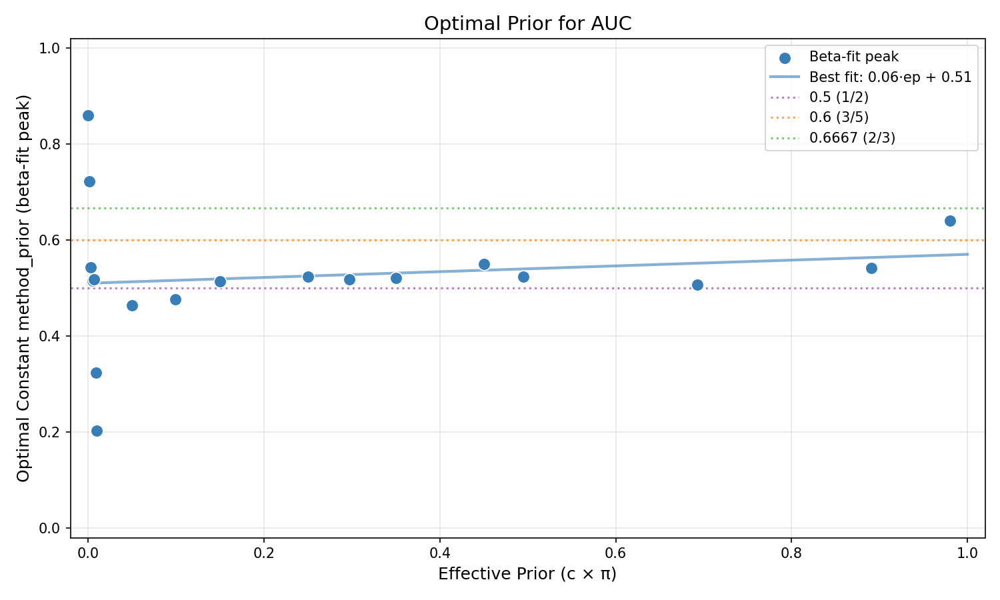

### AP

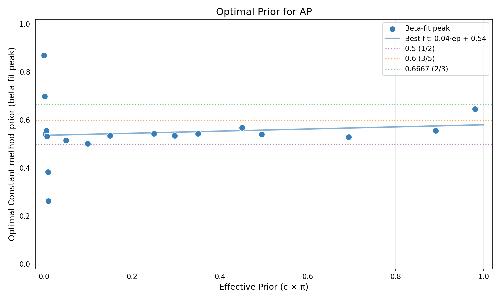

### Max F1

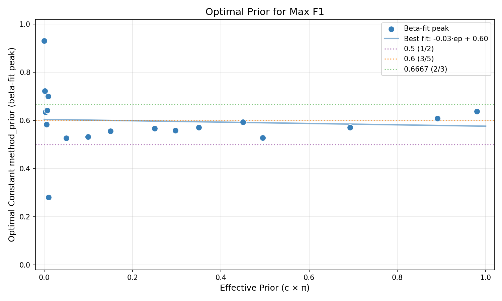

### Accuracy

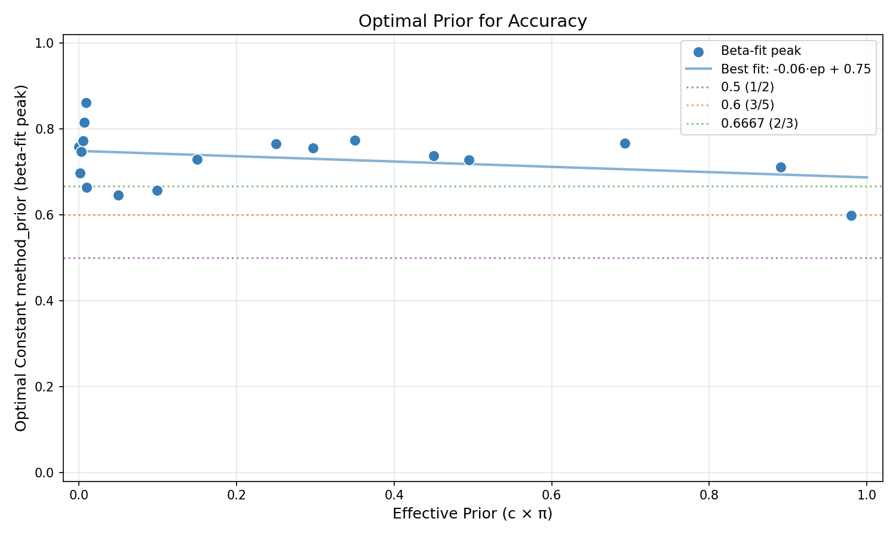

### F1

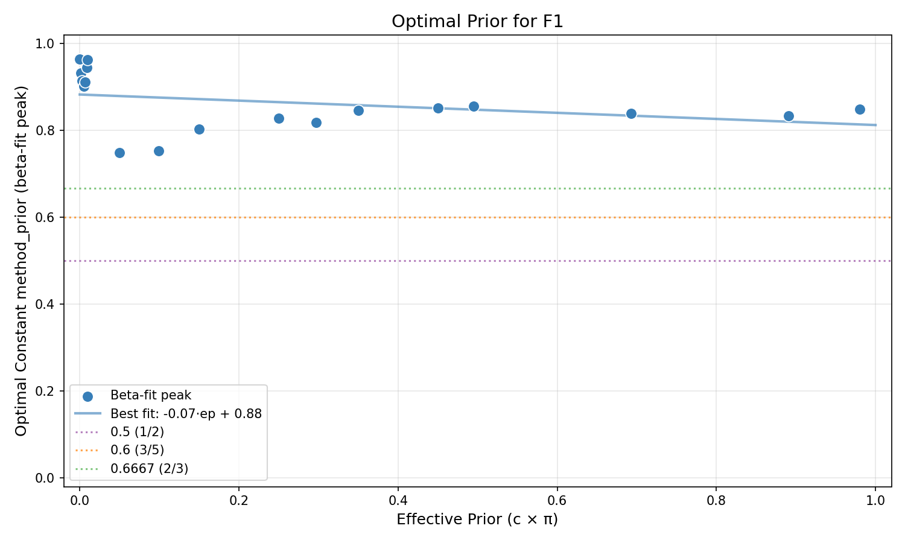

### Precision

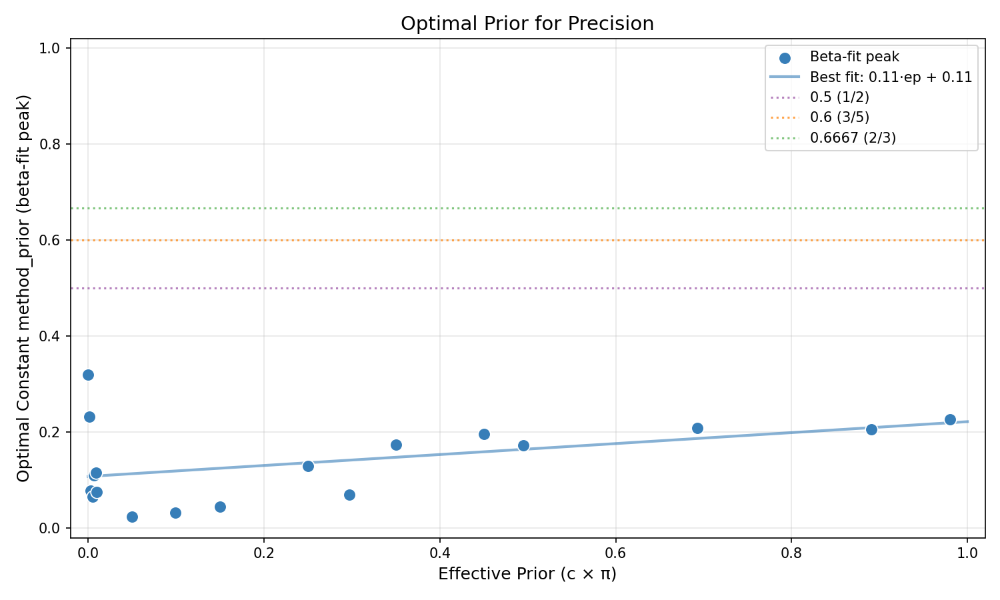

### Recall

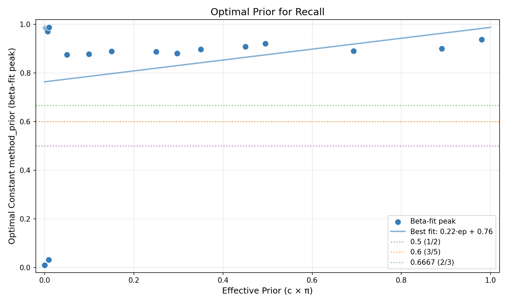

### ECE

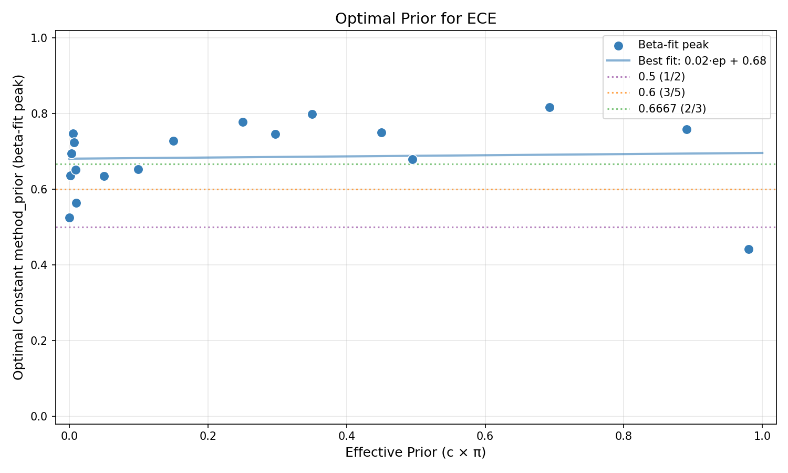

### Brier

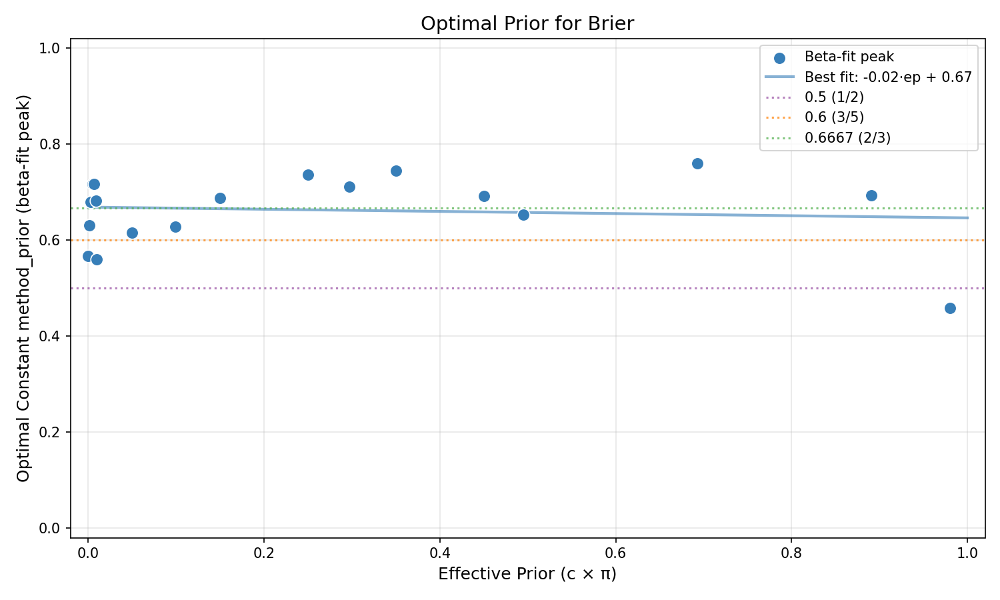

### Oracle CE

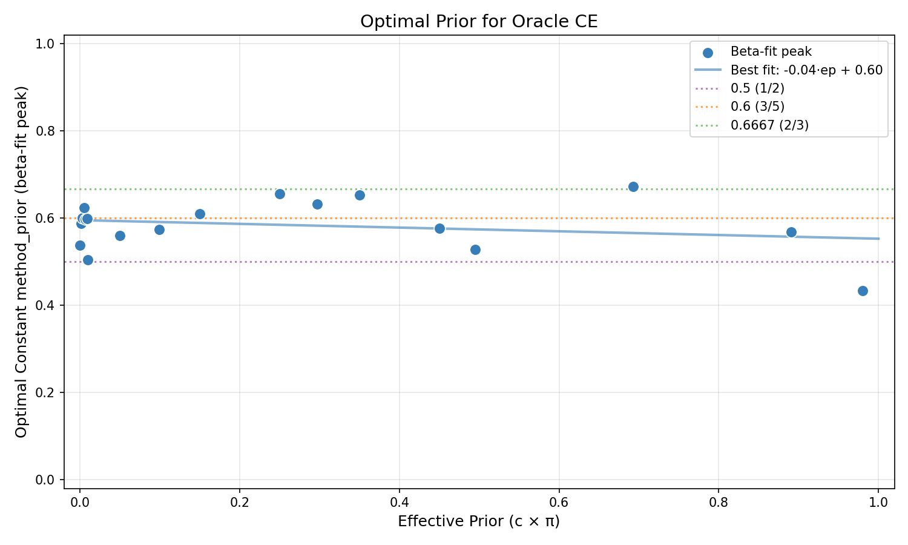

### A-NICE

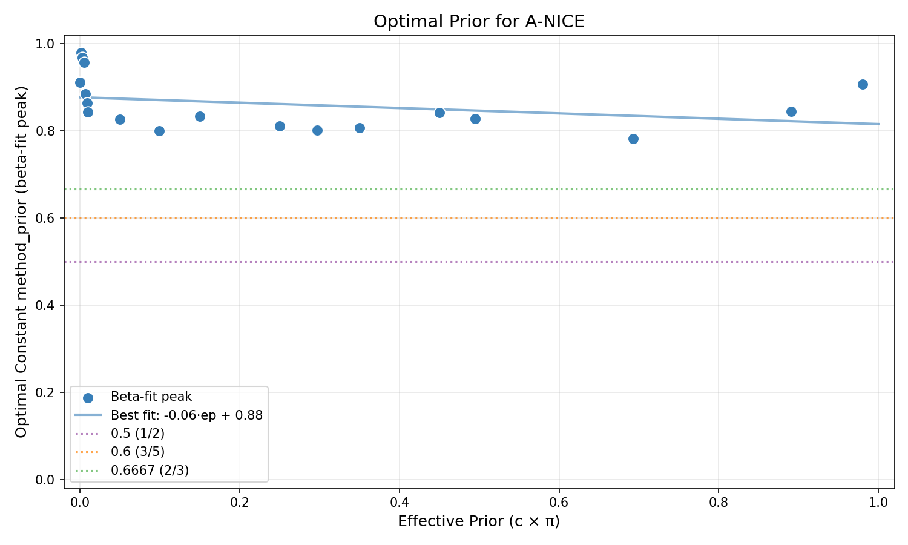

### S-NICE

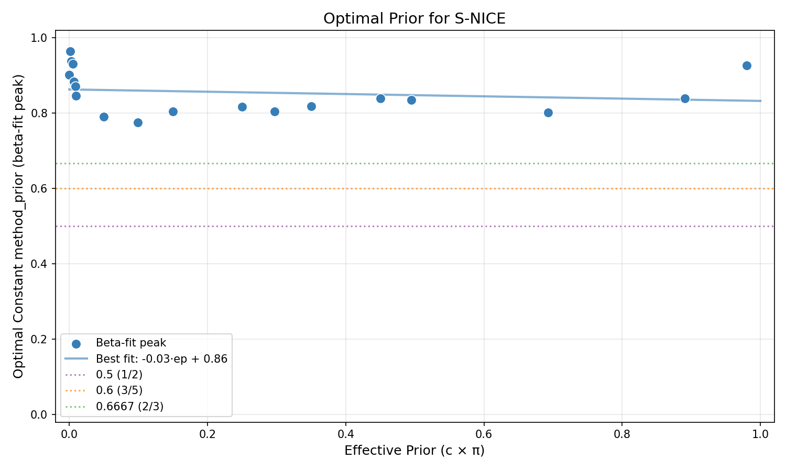

---

## Best Constant method_prior per Bin × Metric

*Rows = effective-prior bins, columns = metrics. Each cell shows the best constant*
*method_prior value (excluding auto, true, ep_linear). Highlights which prior is optimal*
*for each (regime, metric) combination.*

| ep bin | AUC ↑ | AP ↑ | Max F1 ↑ | Accuracy ↑ | F1 ↑ | Precision ↑ | Recall ↑ | ECE ↓ | Brier ↓ | Oracle CE ↓ | Epochs ↓ |
|---|---|---|---|---|---|---|---|---|---|---|---|
| [0.00, 0.20) | 0.3333 | 0.3333 | 0.3333 | 0.5556 | 0.8889 | 0.1111 | 0.9900 | 0.4444 | 0.6667 | 0.6667 | 0.4444 |
| [0.20, 0.40) | 0.4444 | 0.6667 | 0.4444 | 0.5000 | 0.5000 | 0.1111 | 0.9900 | 0.6667 | 0.6667 | 0.6667 | 0.9900 |
| [0.40, 0.60) | 0.5000 | 0.5000 | 0.5000 | 0.5000 | 0.6667 | 0.2222 | 0.9900 | 0.6667 | 0.6667 | 0.6667 | 0.9900 |
| [0.60, 0.80) | 0.5556 | 0.5556 | 0.7778 | 0.5556 | 0.5556 | 0.2222 | 0.9900 | 0.7778 | 0.7778 | 0.7778 | 0.9900 |
| [0.80, 1.00) | 0.6667 | 0.6667 | 0.6667 | 0.5000 | 0.6667 | 0.3333 | 0.9900 | 0.4444 | 0.6667 | 0.5556 | 0.9900 |

---

## Key Finding

**Best method_prior under uniform effective-prior weighting: 0.6667**
- Wins: 3/11 metrics
- Average rank: 3.55

**This differs from the naive winner ((ep+1)/3)**, showing the bias correction matters!
