# Phase 4 Analysis - Uniform Effective-Prior Weighting — VPU-MP (with mixup)

## Why This Analysis?

The effective prior seen by methods is **ep = c × π**. The experimental grid
is heavily biased towards low effective priors:

| Effective Prior Bin | Raw Count | % of Data |
|---------------------|-----------|-----------|
| [0.000, 0.200) | 11,760 | 57.1% |
| [0.200, 0.400) | 2,940 | 14.3% |
| [0.400, 0.600) | 2,940 | 14.3% |
| [0.600, 0.800) | 980 | 4.8% |
| [0.800, 1.000) | 1,960 | 9.5% |

**Problem:** Low ep bins dominate. A naive average gives them disproportionate weight.

**Solution:** Compute mean performance *within* each ep bin, then average across bins
with equal weight. This answers: *if the effective prior were uniformly distributed,*
*which method_prior would work best?*

**Configuration:**
- **Methods**: vpu_mean_prior
- **Seeds**: 10 ['seed_100', 'seed_1024', 'seed_200', 'seed_2048', 'seed_300', 'seed_400', 'seed_42', 'seed_456', 'seed_500', 'seed_789']
- **Datasets**: 7 | **c**: 3 [0.01, 0.5, 0.99] | **π**: 7 [0.01–0.99]
- **Effective prior bins**: 5 equal-width bins across [0, 1]

---

## Naive vs Uniform-Weighted Rankings (Test AUC)

| method_prior | Naive Mean | Naive Rank | Uniform Mean | Uniform Rank | Bins w/ Data |
|--------------|------------|------------|--------------|--------------|--------------|
| auto | 0.8364 | 12 | 0.8623 | 11 | 5/5 |
| true | 0.8420 | 11 | 0.8752 | 10 | 5/5 |
| (ep+1)/3 | **0.8790** | 1 | **0.9125** | 1 | 5/5 |
| 0.0100 | 0.7764 | 14 | 0.7778 | 14 | 5/5 |
| 0.1111 | 0.8436 | 10 | 0.8597 | 12 | 5/5 |
| 0.2222 | 0.8634 | 9 | 0.8855 | 9 | 5/5 |
| 0.3333 | 0.8717 | 5 | 0.8975 | 8 | 5/5 |
| 0.4444 | 0.8708 | 6 | 0.9034 | 6 | 5/5 |
| 0.5000 | 0.8728 | 2 | 0.9080 | 5 | 5/5 |
| 0.5556 | 0.8718 | 4 | 0.9083 | 4 | 5/5 |
| 0.6667 | 0.8719 | 3 | 0.9105 | 2 | 5/5 |
| 0.7778 | 0.8705 | 7 | 0.9098 | 3 | 5/5 |
| 0.8889 | 0.8659 | 8 | 0.9033 | 7 | 5/5 |
| 0.9900 | 0.8051 | 13 | 0.7968 | 13 | 5/5 |

---

## Uniform-Weighted Performance Across All Metrics

*Mean across 5 equal-width effective-prior bins. **Bold** = best per metric.*

| method_prior | AUC ↑ | AP ↑ | Max F1 ↑ | Accuracy ↑ | F1 ↑ | Precision ↑ | Recall ↑ | ECE ↓ | Brier ↓ | Oracle CE ↓ | Epochs ↓ |
|---|---|---|---|---|---|---|---|---|---|---|---|
| auto | 0.862 ± 0.086 | 0.868 ± 0.080 | 0.859 ± 0.055 | 0.763 ± 0.099 | 0.794 ± 0.099 | 0.769 ± 0.096 | 0.901 ± 0.141 | 0.221 ± 0.099 | 0.206 ± 0.103 | 0.846 ± 0.520 | 14.534 ± 3.983 |
| true | 0.875 ± 0.072 | 0.879 ± 0.068 | 0.865 ± 0.049 | 0.767 ± 0.100 | 0.791 ± 0.108 | 0.782 ± 0.100 | 0.883 ± 0.152 | 0.235 ± 0.084 | 0.204 ± 0.098 | 0.794 ± 0.431 | 15.158 ± 3.228 |
| (ep+1)/3 | **0.912 ± 0.044** | **0.915 ± 0.041** | **0.887 ± 0.034** | 0.822 ± 0.063 | 0.816 ± 0.085 | 0.849 ± 0.064 | 0.833 ± 0.126 | 0.200 ± 0.044 | 0.156 ± 0.046 | 0.486 ± 0.124 | 17.597 ± 2.739 |
| 0.0100 | 0.778 ± 0.057 | 0.771 ± 0.051 | 0.786 ± 0.023 | 0.517 ± 0.022 | 0.141 ± 0.050 | 0.822 ± 0.068 | 0.118 ± 0.039 | 0.332 ± 0.005 | 0.321 ± 0.011 | 0.964 ± 0.048 | 14.034 ± 2.533 |
| 0.1111 | 0.860 ± 0.065 | 0.859 ± 0.060 | 0.850 ± 0.038 | 0.567 ± 0.036 | 0.266 ± 0.077 | 0.896 ± 0.063 | 0.181 ± 0.077 | 0.317 ± 0.035 | 0.279 ± 0.024 | 0.766 ± 0.055 | 16.604 ± 2.983 |
| 0.2222 | 0.886 ± 0.056 | 0.886 ± 0.052 | 0.869 ± 0.038 | 0.627 ± 0.050 | 0.400 ± 0.109 | **0.910 ± 0.051** | 0.309 ± 0.108 | 0.277 ± 0.046 | 0.227 ± 0.029 | 0.632 ± 0.066 | 16.884 ± 3.367 |
| 0.3333 | 0.897 ± 0.051 | 0.899 ± 0.048 | 0.878 ± 0.036 | 0.708 ± 0.065 | 0.572 ± 0.125 | 0.905 ± 0.045 | 0.501 ± 0.126 | 0.233 ± 0.045 | 0.186 ± 0.031 | 0.542 ± 0.072 | 17.227 ± 2.636 |
| 0.4444 | 0.903 ± 0.050 | 0.907 ± 0.045 | 0.884 ± 0.036 | 0.797 ± 0.084 | 0.762 ± 0.117 | 0.871 ± 0.047 | 0.741 ± 0.114 | 0.208 ± 0.054 | 0.164 ± 0.043 | 0.494 ± 0.102 | 17.470 ± 2.738 |
| 0.5000 | 0.908 ± 0.047 | 0.911 ± 0.043 | 0.885 ± 0.035 | **0.830 ± 0.061** | 0.816 ± 0.078 | 0.863 ± 0.037 | 0.819 ± 0.087 | 0.194 ± 0.044 | 0.154 ± 0.042 | 0.478 ± 0.105 | 17.434 ± 2.450 |
| 0.5556 | 0.908 ± 0.048 | 0.911 ± 0.044 | 0.885 ± 0.036 | 0.829 ± 0.060 | 0.835 ± 0.065 | 0.833 ± 0.052 | 0.876 ± 0.072 | 0.181 ± 0.046 | **0.144 ± 0.042** | **0.444 ± 0.097** | 17.205 ± 2.739 |
| 0.6667 | 0.911 ± 0.048 | 0.913 ± 0.044 | 0.886 ± 0.035 | 0.823 ± 0.055 | **0.846 ± 0.051** | 0.806 ± 0.052 | 0.916 ± 0.061 | 0.171 ± 0.057 | 0.145 ± 0.052 | 0.460 ± 0.145 | 17.497 ± 2.474 |
| 0.7778 | 0.910 ± 0.049 | 0.912 ± 0.045 | 0.885 ± 0.036 | 0.807 ± 0.058 | 0.839 ± 0.048 | 0.783 ± 0.058 | 0.936 ± 0.054 | **0.163 ± 0.048** | 0.151 ± 0.053 | 0.463 ± 0.131 | 17.292 ± 2.378 |
| 0.8889 | 0.903 ± 0.051 | 0.907 ± 0.047 | 0.882 ± 0.036 | 0.782 ± 0.066 | 0.828 ± 0.047 | 0.758 ± 0.065 | 0.952 ± 0.043 | 0.196 ± 0.057 | 0.178 ± 0.064 | 0.572 ± 0.163 | 16.875 ± 1.856 |
| 0.9900 | 0.797 ± 0.053 | 0.811 ± 0.051 | 0.828 ± 0.034 | 0.677 ± 0.062 | 0.776 ± 0.039 | 0.668 ± 0.059 | **0.985 ± 0.020** | 0.322 ± 0.061 | 0.309 ± 0.066 | 1.398 ± 0.334 | **9.919 ± 2.577** |

---

## Uniform-Weighted Rankings

*11 metrics*

| method_prior | Wins | Avg Rank |
|--------------|------|----------|
| 0.6667 | 1/11 | 3.82 |
| 0.5556 | 2/11 | 4.09 |
| 0.7778 | 1/11 | 4.18 |
| (ep+1)/3 | 3/11 | 5.09 |
| 0.5000 | 1/11 | 5.27 |
| 0.8889 | 0/11 | 6.64 |
| 0.4444 | 0/11 | 7.18 |
| 0.3333 | 0/11 | 8.27 |
| true | 0/11 | 8.82 |
| auto | 0/11 | 9.00 |
| 0.2222 | 1/11 | 9.27 |
| 0.9900 | 2/11 | 10.45 |
| 0.1111 | 0/11 | 10.64 |
| 0.0100 | 0/11 | 12.27 |

---

## Per-Bin Rankings (Test AUC)

*Which method_prior works best in each effective-prior range?*

| method_prior | [0.00, 0.20) | [0.20, 0.40) | [0.40, 0.60) | [0.60, 0.80) | [0.80, 1.00) |
|---|---|---|---|---|---|
| auto | 0.811 | 0.959 | 0.835 | 0.963 | 0.743 |
| true | 0.809 | 0.958 | 0.847 | 0.963 | 0.799 |
| (ep+1)/3 | 0.845 | **0.959** | 0.892 | 0.963 | 0.904 |
| 0.0100 | 0.773 | 0.860 | 0.747 | 0.814 | 0.695 |
| 0.1111 | 0.827 | 0.942 | 0.830 | 0.926 | 0.772 |
| 0.2222 | 0.841 | 0.954 | 0.865 | 0.949 | 0.819 |
| 0.3333 | **0.845** | 0.957 | 0.883 | 0.958 | 0.844 |
| 0.4444 | 0.837 | 0.959 | 0.888 | 0.962 | 0.871 |
| 0.5000 | 0.836 | 0.959 | **0.893** | 0.962 | 0.890 |
| 0.5556 | 0.834 | 0.959 | 0.891 | 0.963 | 0.895 |
| 0.6667 | 0.832 | 0.959 | 0.893 | **0.963** | 0.906 |
| 0.7778 | 0.830 | 0.958 | 0.891 | 0.963 | **0.906** |
| 0.8889 | 0.827 | 0.957 | 0.889 | 0.962 | 0.882 |
| 0.9900 | 0.810 | 0.879 | 0.765 | 0.809 | 0.720 |

**Best method_prior per bin:**

- **ep ∈ [0.00, 0.20)**: 0.3333
- **ep ∈ [0.20, 0.40)**: (ep+1)/3
- **ep ∈ [0.40, 0.60)**: 0.5000
- **ep ∈ [0.60, 0.80)**: 0.6667
- **ep ∈ [0.80, 1.00)**: 0.7778

---

## Per-Bin Rankings (Oracle Cross-Entropy)

*Which method_prior achieves best calibration in each effective-prior range? (lower = better)*

| method_prior | [0.00, 0.20) | [0.20, 0.40) | [0.40, 0.60) | [0.60, 0.80) | [0.80, 1.00) |
|---|---|---|---|---|---|
| auto | 0.822 | **0.286** | 1.136 | 0.320 | 1.669 |
| true | 0.851 | 0.327 | 1.048 | 0.310 | 1.433 |
| (ep+1)/3 | 0.511 | 0.350 | 0.514 | 0.365 | 0.692 |
| 0.0100 | 1.028 | 0.891 | 0.983 | 0.929 | 0.987 |
| 0.1111 | 0.678 | 0.724 | 0.799 | 0.815 | 0.813 |
| 0.2222 | 0.556 | 0.556 | 0.674 | 0.657 | 0.720 |
| 0.3333 | 0.515 | 0.433 | 0.581 | 0.532 | 0.649 |
| 0.4444 | **0.497** | 0.339 | 0.554 | 0.439 | 0.639 |
| 0.5000 | 0.555 | 0.314 | 0.516 | 0.406 | 0.601 |
| 0.5556 | 0.519 | 0.299 | **0.467** | 0.371 | **0.564** |
| 0.6667 | 0.509 | 0.297 | 0.486 | 0.315 | 0.692 |
| 0.7778 | 0.545 | 0.322 | 0.508 | **0.301** | 0.637 |
| 0.8889 | 0.635 | 0.391 | 0.629 | 0.390 | 0.815 |
| 0.9900 | 1.256 | 1.029 | 1.636 | 1.145 | 1.927 |

**Best method_prior per bin (Oracle CE):**

- **ep ∈ [0.00, 0.20)**: 0.4444
- **ep ∈ [0.20, 0.40)**: auto
- **ep ∈ [0.40, 0.60)**: 0.5556
- **ep ∈ [0.60, 0.80)**: 0.7778
- **ep ∈ [0.80, 1.00)**: 0.5556

---

## Optimal Constant method_prior vs Effective Prior (Beta-Fit)

*For each effective prior, a beta distribution is fit to metric(method_prior),*
*and its mode gives the smoothed optimal prior (y-axis). This uses all 11 constant*
*prior data points rather than just the argmax, reducing noise.*

### AUC

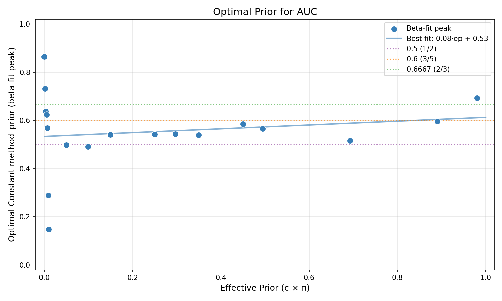

### AP

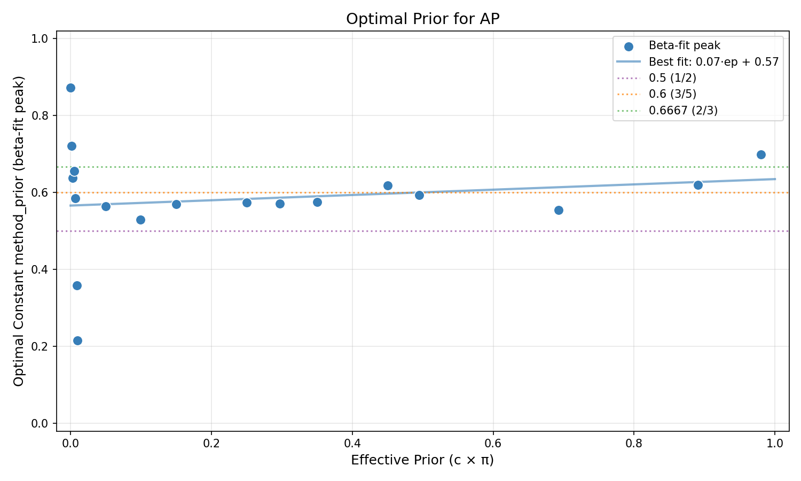

### Max F1

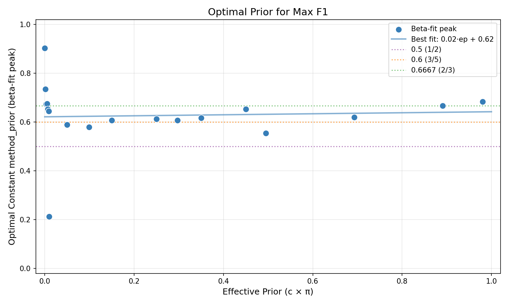

### Accuracy

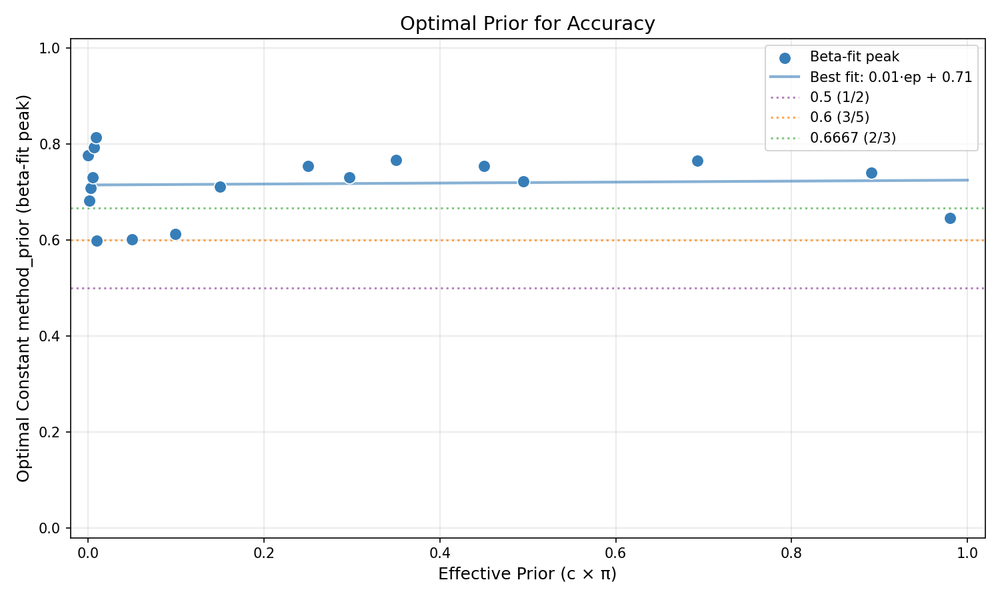

### F1

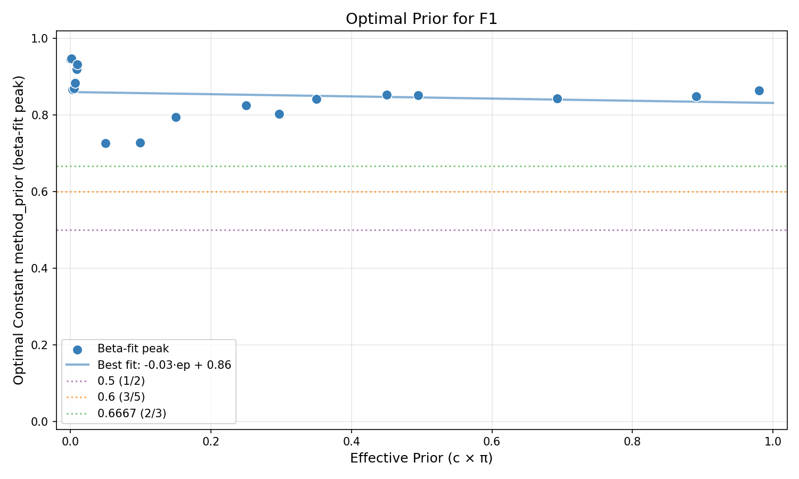

### Precision

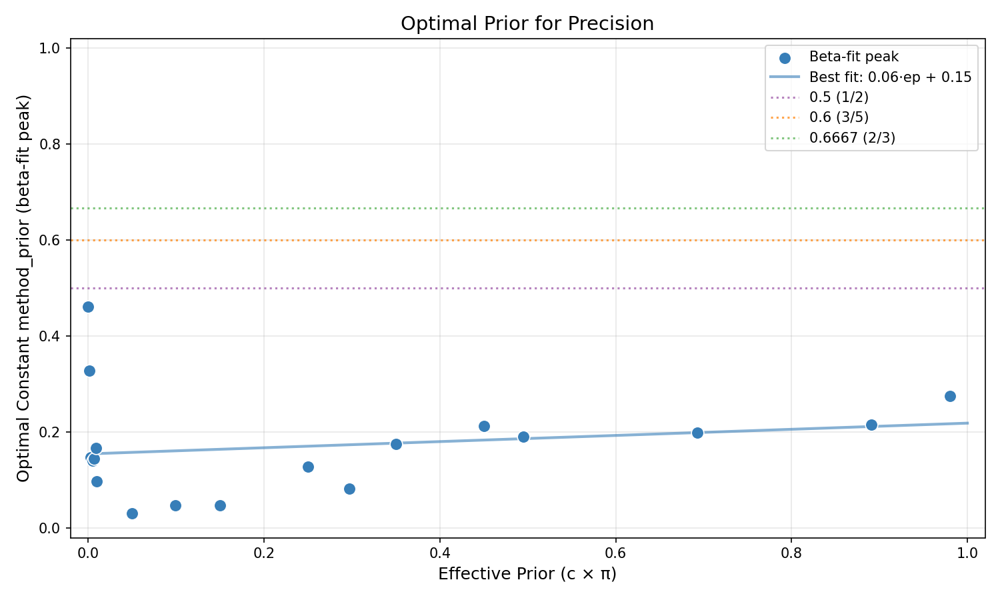

### Recall

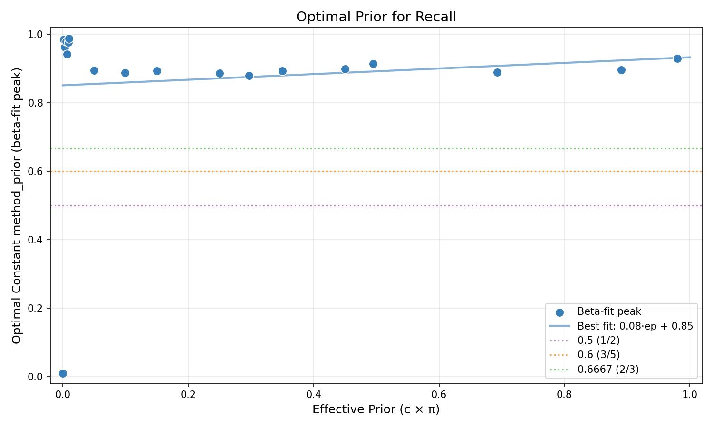

### ECE

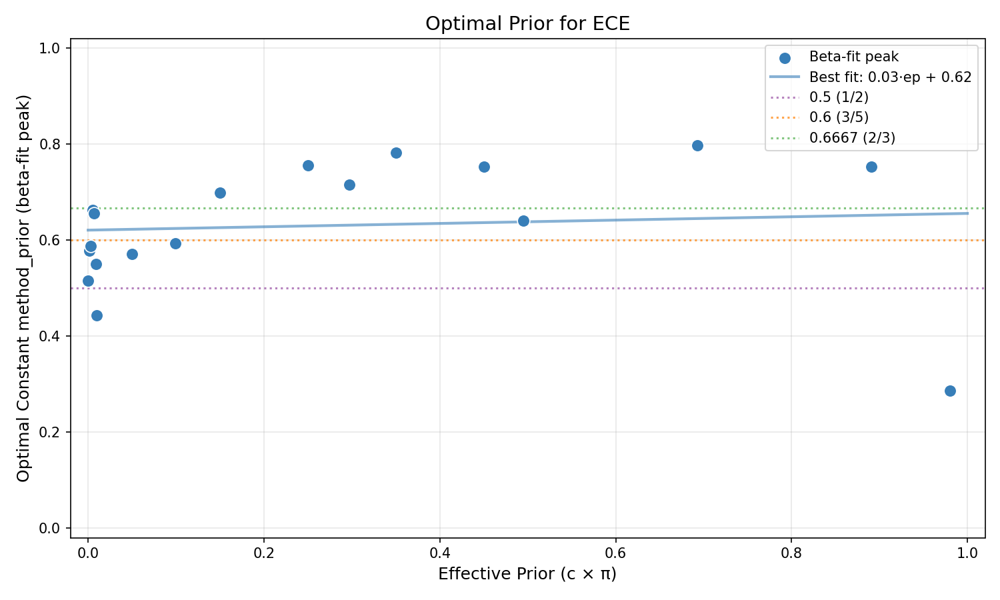

### Brier

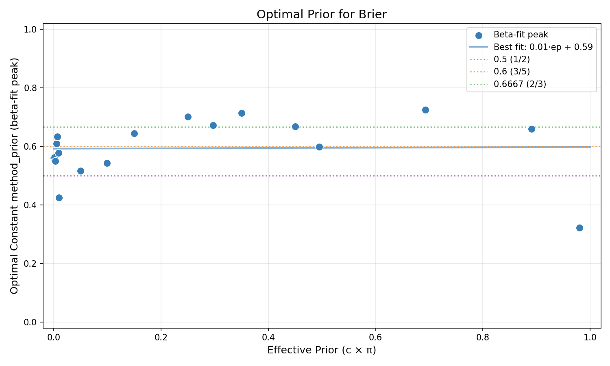

### Oracle CE

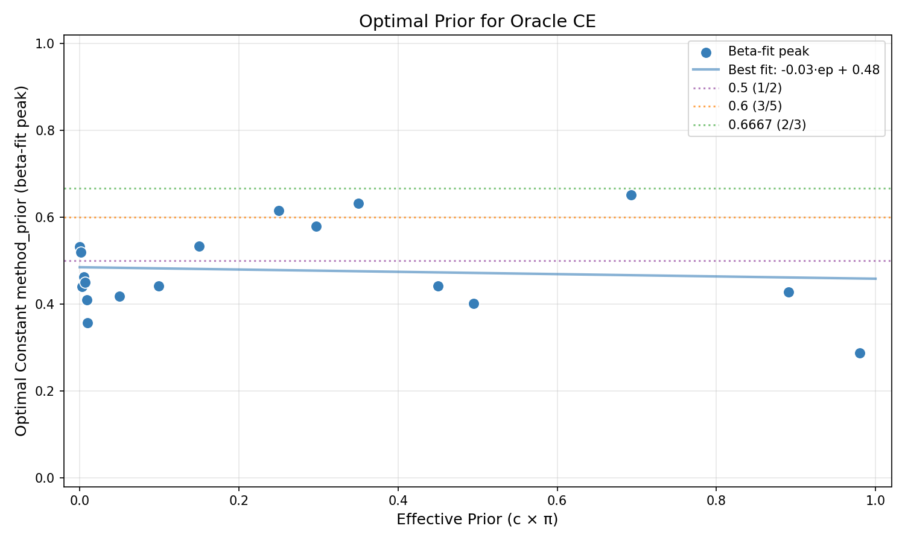

### A-NICE

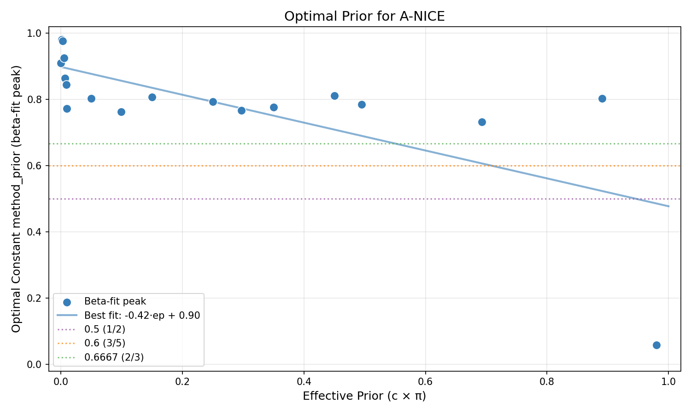

### S-NICE

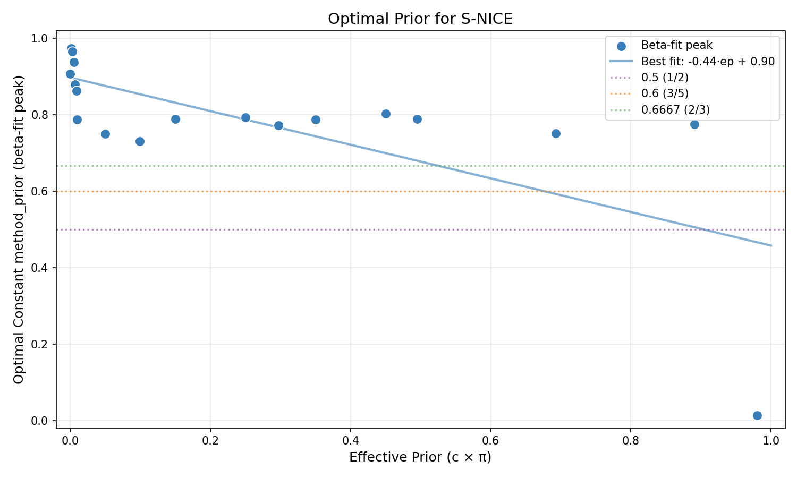

---

## Best Constant method_prior per Bin × Metric

*Rows = effective-prior bins, columns = metrics. Each cell shows the best constant*
*method_prior value (excluding auto, true, ep_linear). Highlights which prior is optimal*
*for each (regime, metric) combination.*

| ep bin | AUC ↑ | AP ↑ | Max F1 ↑ | Accuracy ↑ | F1 ↑ | Precision ↑ | Recall ↑ | ECE ↓ | Brier ↓ | Oracle CE ↓ | Epochs ↓ |
|---|---|---|---|---|---|---|---|---|---|---|---|
| [0.00, 0.20) | 0.3333 | 0.3333 | 0.3333 | 0.5556 | 0.8889 | 0.1111 | 0.9900 | 0.4444 | 0.4444 | 0.4444 | 0.4444 |
| [0.20, 0.40) | 0.4444 | 0.4444 | 0.4444 | 0.5000 | 0.5000 | 0.1111 | 0.9900 | 0.6667 | 0.6667 | 0.6667 | 0.9900 |
| [0.40, 0.60) | 0.5000 | 0.6667 | 0.5000 | 0.5556 | 0.6667 | 0.2222 | 0.9900 | 0.6667 | 0.5556 | 0.5556 | 0.9900 |
| [0.60, 0.80) | 0.6667 | 0.6667 | 0.7778 | 0.5556 | 0.5556 | 0.2222 | 0.9900 | 0.7778 | 0.6667 | 0.7778 | 0.9900 |
| [0.80, 1.00) | 0.7778 | 0.6667 | 0.6667 | 0.5000 | 0.6667 | 0.3333 | 0.9900 | 0.7778 | 0.5556 | 0.5556 | 0.9900 |

---

## Key Finding

**Best method_prior under uniform effective-prior weighting: 0.6667**
- Wins: 1/11 metrics
- Average rank: 3.82

**This differs from the naive winner ((ep+1)/3)**, showing the bias correction matters!
