# Phase 4 Analysis - Uniform Effective-Prior Weighting — VPU-nomix-MP (no mixup)

## Why This Analysis?

The effective prior seen by methods is **ep = c × π**. The experimental grid
is heavily biased towards low effective priors:

| Effective Prior Bin | Raw Count | % of Data |
|---------------------|-----------|-----------|
| [0.000, 0.200) | 11,760 | 57.1% |
| [0.200, 0.400) | 2,940 | 14.3% |
| [0.400, 0.600) | 2,940 | 14.3% |
| [0.600, 0.800) | 980 | 4.8% |
| [0.800, 1.000) | 1,960 | 9.5% |

**Problem:** Low ep bins dominate. A naive average gives them disproportionate weight.

**Solution:** Compute mean performance *within* each ep bin, then average across bins
with equal weight. This answers: *if the effective prior were uniformly distributed,*
*which method_prior would work best?*

**Configuration:**
- **Methods**: vpu_nomixup_mean_prior
- **Seeds**: 10 ['seed_100', 'seed_1024', 'seed_200', 'seed_2048', 'seed_300', 'seed_400', 'seed_42', 'seed_456', 'seed_500', 'seed_789']
- **Datasets**: 7 | **c**: 3 [0.01, 0.5, 0.99] | **π**: 7 [0.01–0.99]
- **Effective prior bins**: 5 equal-width bins across [0, 1]

---

## Naive vs Uniform-Weighted Rankings (Test AUC)

| method_prior | Naive Mean | Naive Rank | Uniform Mean | Uniform Rank | Bins w/ Data |
|--------------|------------|------------|--------------|--------------|--------------|
| auto | 0.8455 | 12 | 0.8659 | 12 | 5/5 |
| true | 0.8513 | 11 | 0.8773 | 11 | 5/5 |
| (ep+1)/3 | **0.8666** | 1 | **0.9024** | 1 | 5/5 |
| 0.0100 | 0.8068 | 13 | 0.7953 | 14 | 5/5 |
| 0.1111 | 0.8600 | 9 | 0.8881 | 10 | 5/5 |
| 0.2222 | 0.8639 | 7 | 0.8965 | 8 | 5/5 |
| 0.3333 | 0.8663 | 2 | 0.9012 | 4 | 5/5 |
| 0.4444 | 0.8663 | 3 | 0.9023 | 3 | 5/5 |
| 0.5000 | 0.8662 | 4 | 0.9024 | 2 | 5/5 |
| 0.5556 | 0.8644 | 5 | 0.9008 | 6 | 5/5 |
| 0.6667 | 0.8642 | 6 | 0.9008 | 5 | 5/5 |
| 0.7778 | 0.8625 | 8 | 0.8987 | 7 | 5/5 |
| 0.8889 | 0.8578 | 10 | 0.8911 | 9 | 5/5 |
| 0.9900 | 0.8040 | 14 | 0.7978 | 13 | 5/5 |

---

## Uniform-Weighted Performance Across All Metrics

*Mean across 5 equal-width effective-prior bins. **Bold** = best per metric.*

| method_prior | AUC ↑ | AP ↑ | Max F1 ↑ | Accuracy ↑ | F1 ↑ | Precision ↑ | Recall ↑ | ECE ↓ | Brier ↓ | Oracle CE ↓ | Epochs ↓ |
|---|---|---|---|---|---|---|---|---|---|---|---|
| auto | 0.866 ± 0.085 | 0.872 ± 0.079 | 0.861 ± 0.055 | 0.773 ± 0.108 | 0.794 ± 0.119 | 0.788 ± 0.104 | 0.889 ± 0.163 | 0.201 ± 0.115 | 0.204 ± 0.110 | 0.867 ± 0.535 | 13.010 ± 3.986 |
| true | 0.877 ± 0.071 | 0.882 ± 0.066 | 0.867 ± 0.049 | 0.773 ± 0.110 | 0.785 ± 0.137 | 0.801 ± 0.107 | 0.867 ± 0.184 | 0.221 ± 0.101 | 0.206 ± 0.106 | 0.824 ± 0.459 | 13.383 ± 3.225 |
| (ep+1)/3 | **0.902 ± 0.052** | 0.905 ± 0.047 | 0.881 ± 0.039 | 0.827 ± 0.072 | 0.811 ± 0.099 | 0.863 ± 0.064 | 0.804 ± 0.144 | 0.172 ± 0.026 | 0.152 ± 0.046 | 0.481 ± 0.141 | 14.918 ± 2.293 |
| 0.0100 | 0.795 ± 0.056 | 0.810 ± 0.053 | 0.829 ± 0.035 | 0.504 ± 0.010 | 0.062 ± 0.026 | 0.861 ± 0.054 | 0.043 ± 0.028 | 0.500 ± 0.008 | 0.496 ± 0.012 | 2.279 ± 0.079 | 9.862 ± 0.884 |
| 0.1111 | 0.888 ± 0.061 | 0.893 ± 0.056 | 0.874 ± 0.043 | 0.592 ± 0.018 | 0.350 ± 0.025 | **0.930 ± 0.048** | 0.227 ± 0.033 | 0.407 ± 0.028 | 0.375 ± 0.030 | 1.088 ± 0.058 | 14.391 ± 3.238 |
| 0.2222 | 0.896 ± 0.056 | 0.900 ± 0.051 | 0.878 ± 0.041 | 0.671 ± 0.021 | 0.537 ± 0.052 | 0.923 ± 0.047 | 0.400 ± 0.049 | 0.322 ± 0.033 | 0.279 ± 0.033 | 0.771 ± 0.074 | 14.755 ± 3.185 |
| 0.3333 | 0.901 ± 0.053 | 0.904 ± 0.048 | 0.881 ± 0.039 | 0.741 ± 0.033 | 0.649 ± 0.046 | 0.909 ± 0.043 | 0.553 ± 0.054 | 0.246 ± 0.033 | 0.210 ± 0.037 | 0.609 ± 0.101 | 15.035 ± 2.500 |
| 0.4444 | 0.902 ± 0.052 | 0.905 ± 0.047 | **0.881 ± 0.039** | 0.808 ± 0.073 | 0.760 ± 0.109 | 0.895 ± 0.041 | 0.714 ± 0.115 | 0.174 ± 0.032 | 0.164 ± 0.041 | 0.509 ± 0.122 | 15.151 ± 2.369 |
| 0.5000 | 0.902 ± 0.052 | **0.905 ± 0.047** | 0.881 ± 0.039 | 0.834 ± 0.072 | 0.807 ± 0.105 | 0.885 ± 0.032 | 0.782 ± 0.125 | 0.164 ± 0.040 | 0.159 ± 0.055 | 0.608 ± 0.286 | 15.037 ± 2.331 |
| 0.5556 | 0.901 ± 0.053 | 0.904 ± 0.048 | 0.880 ± 0.039 | **0.837 ± 0.067** | 0.842 ± 0.077 | 0.845 ± 0.054 | 0.864 ± 0.092 | 0.175 ± 0.062 | 0.155 ± 0.060 | 0.492 ± 0.166 | 15.075 ± 2.404 |
| 0.6667 | 0.901 ± 0.053 | 0.904 ± 0.048 | 0.880 ± 0.039 | 0.828 ± 0.068 | **0.845 ± 0.067** | 0.818 ± 0.060 | 0.902 ± 0.078 | 0.144 ± 0.060 | **0.137 ± 0.055** | **0.438 ± 0.151** | 15.054 ± 2.241 |
| 0.7778 | 0.899 ± 0.055 | 0.902 ± 0.050 | 0.880 ± 0.039 | 0.818 ± 0.070 | 0.844 ± 0.061 | 0.798 ± 0.067 | 0.923 ± 0.065 | **0.133 ± 0.056** | 0.142 ± 0.058 | 0.463 ± 0.163 | 15.280 ± 2.056 |
| 0.8889 | 0.891 ± 0.058 | 0.895 ± 0.054 | 0.877 ± 0.040 | 0.799 ± 0.079 | 0.837 ± 0.059 | 0.777 ± 0.074 | 0.942 ± 0.054 | 0.164 ± 0.066 | 0.167 ± 0.069 | 0.572 ± 0.177 | 15.433 ± 2.744 |
| 0.9900 | 0.798 ± 0.051 | 0.813 ± 0.048 | 0.829 ± 0.034 | 0.696 ± 0.075 | 0.786 ± 0.048 | 0.684 ± 0.069 | **0.980 ± 0.026** | 0.293 ± 0.077 | 0.291 ± 0.078 | 1.341 ± 0.378 | **9.561 ± 2.123** |

---

## Uniform-Weighted Rankings

*11 metrics*

| method_prior | Wins | Avg Rank |
|--------------|------|----------|
| (ep+1)/3 | 1/11 | 4.27 |
| 0.6667 | 3/11 | 4.27 |
| 0.5000 | 1/11 | 4.73 |
| 0.7778 | 1/11 | 5.45 |
| 0.5556 | 1/11 | 5.55 |
| 0.4444 | 1/11 | 5.91 |
| 0.3333 | 0/11 | 7.64 |
| 0.8889 | 0/11 | 7.64 |
| auto | 0/11 | 8.91 |
| true | 0/11 | 9.00 |
| 0.2222 | 0/11 | 9.09 |
| 0.9900 | 2/11 | 10.09 |
| 0.1111 | 1/11 | 10.27 |
| 0.0100 | 0/11 | 12.18 |

---

## Per-Bin Rankings (Test AUC)

*Which method_prior works best in each effective-prior range?*

| method_prior | [0.00, 0.20) | [0.20, 0.40) | [0.40, 0.60) | [0.60, 0.80) | [0.80, 1.00) |
|---|---|---|---|---|---|
| auto | 0.826 | 0.961 | 0.836 | 0.963 | 0.743 |
| true | 0.827 | **0.961** | 0.843 | 0.964 | 0.793 |
| (ep+1)/3 | 0.829 | 0.960 | **0.885** | 0.964 | 0.874 |
| 0.0100 | 0.816 | 0.878 | 0.761 | 0.809 | 0.712 |
| 0.1111 | **0.832** | 0.960 | 0.865 | 0.963 | 0.822 |
| 0.2222 | 0.830 | 0.960 | 0.879 | **0.964** | 0.849 |
| 0.3333 | 0.830 | 0.960 | 0.885 | 0.964 | 0.867 |
| 0.4444 | 0.829 | 0.960 | 0.885 | 0.964 | 0.874 |
| 0.5000 | 0.829 | 0.960 | 0.885 | 0.964 | **0.875** |
| 0.5556 | 0.827 | 0.960 | 0.881 | 0.964 | 0.873 |
| 0.6667 | 0.826 | 0.960 | 0.884 | 0.963 | 0.872 |
| 0.7778 | 0.825 | 0.959 | 0.884 | 0.963 | 0.862 |
| 0.8889 | 0.823 | 0.958 | 0.874 | 0.962 | 0.839 |
| 0.9900 | 0.807 | 0.879 | 0.767 | 0.810 | 0.726 |

**Best method_prior per bin:**

- **ep ∈ [0.00, 0.20)**: 0.1111
- **ep ∈ [0.20, 0.40)**: true
- **ep ∈ [0.40, 0.60)**: (ep+1)/3
- **ep ∈ [0.60, 0.80)**: 0.2222
- **ep ∈ [0.80, 1.00)**: 0.5000

---

## Per-Bin Rankings (Oracle Cross-Entropy)

*Which method_prior achieves best calibration in each effective-prior range? (lower = better)*

| method_prior | [0.00, 0.20) | [0.20, 0.40) | [0.40, 0.60) | [0.60, 0.80) | [0.80, 1.00) |
|---|---|---|---|---|---|
| auto | 1.060 | **0.255** | 1.110 | 0.268 | 1.642 |
| true | 1.136 | 0.308 | 1.034 | 0.252 | 1.387 |
| (ep+1)/3 | 0.707 | 0.338 | 0.480 | 0.329 | **0.552** |
| 0.0100 | 2.146 | 2.236 | 2.331 | 2.320 | 2.362 |
| 0.1111 | 1.095 | 0.986 | 1.110 | 1.080 | 1.166 |
| 0.2222 | 0.827 | 0.645 | 0.787 | 0.742 | 0.855 |
| 0.3333 | 0.729 | 0.450 | 0.616 | 0.552 | 0.697 |
| 0.4444 | 0.671 | 0.329 | 0.512 | 0.427 | 0.606 |
| 0.5000 | 0.656 | 0.298 | 0.595 | 0.376 | 1.115 |
| 0.5556 | 0.691 | 0.279 | 0.495 | 0.335 | 0.658 |
| 0.6667 | **0.652** | 0.280 | **0.426** | 0.271 | 0.561 |
| 0.7778 | 0.666 | 0.320 | 0.476 | **0.241** | 0.610 |
| 0.8889 | 0.760 | 0.394 | 0.596 | 0.343 | 0.764 |
| 0.9900 | 1.269 | 0.930 | 1.602 | 0.978 | 1.925 |

**Best method_prior per bin (Oracle CE):**

- **ep ∈ [0.00, 0.20)**: 0.6667
- **ep ∈ [0.20, 0.40)**: auto
- **ep ∈ [0.40, 0.60)**: 0.6667
- **ep ∈ [0.60, 0.80)**: 0.7778
- **ep ∈ [0.80, 1.00)**: (ep+1)/3

---

## Optimal Constant method_prior vs Effective Prior (Beta-Fit)

*For each effective prior, a beta distribution is fit to metric(method_prior),*
*and its mode gives the smoothed optimal prior (y-axis). This uses all 11 constant*
*prior data points rather than just the argmax, reducing noise.*

### AUC

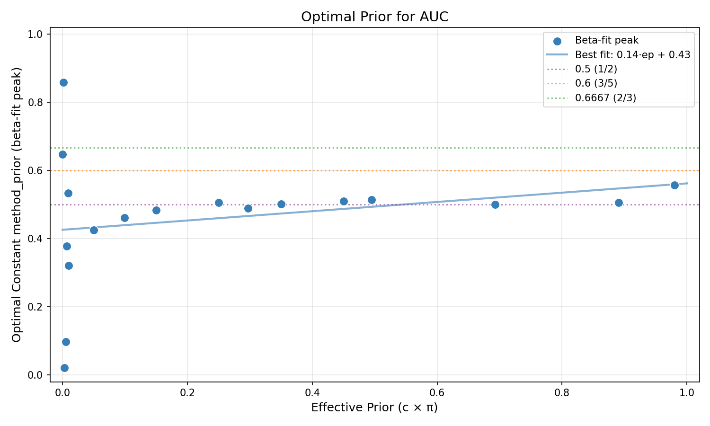

### AP

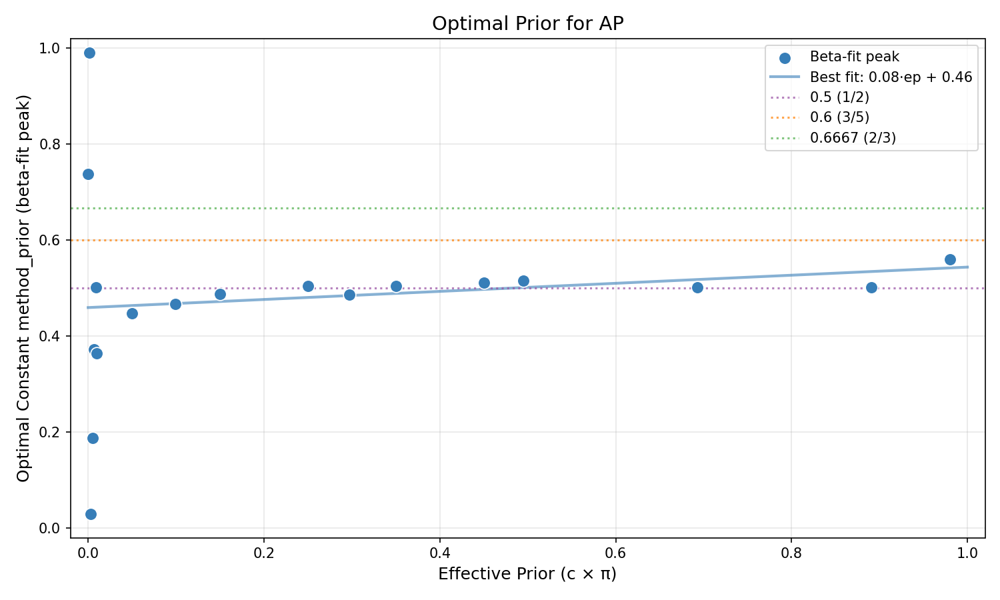

### Max F1

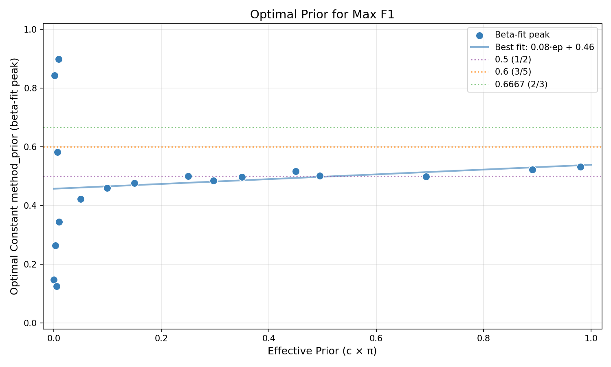

### Accuracy

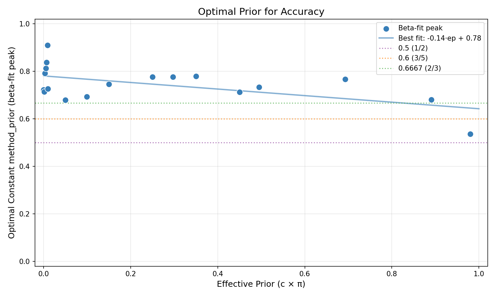

### F1

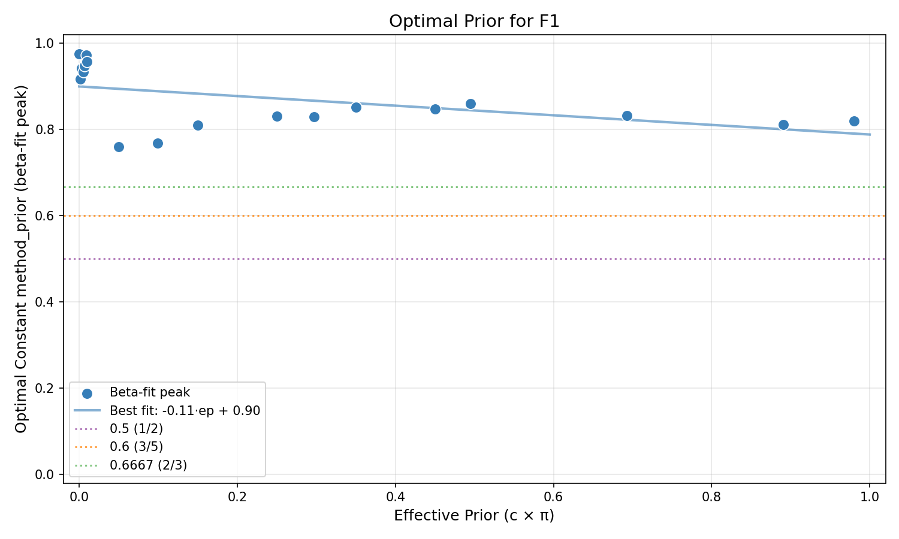

### Precision

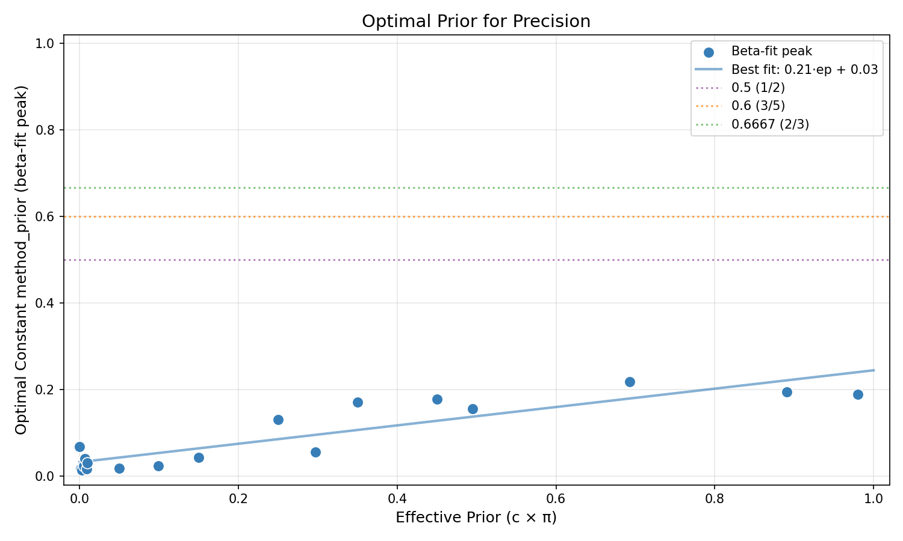

### Recall

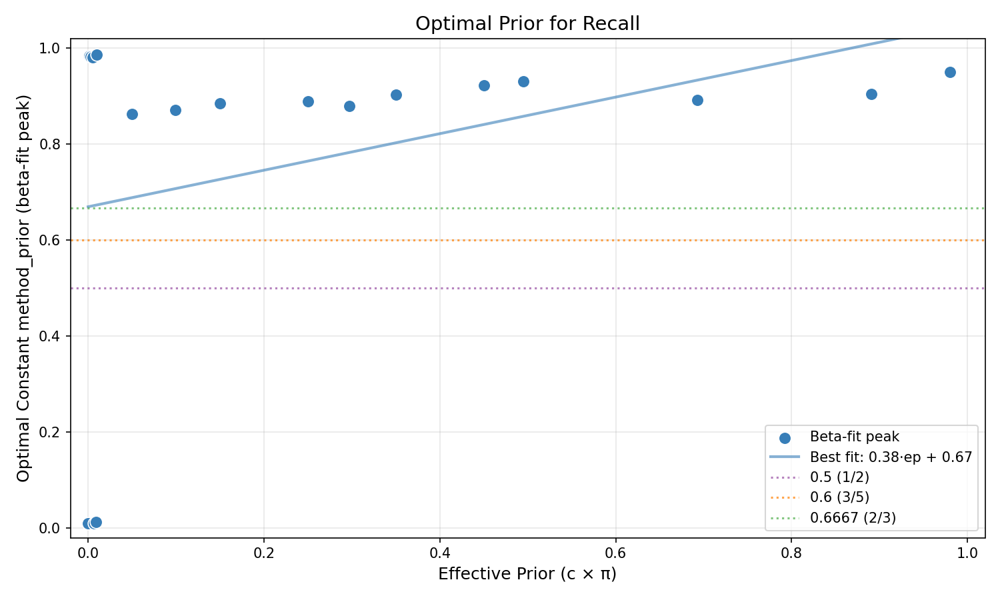

### ECE

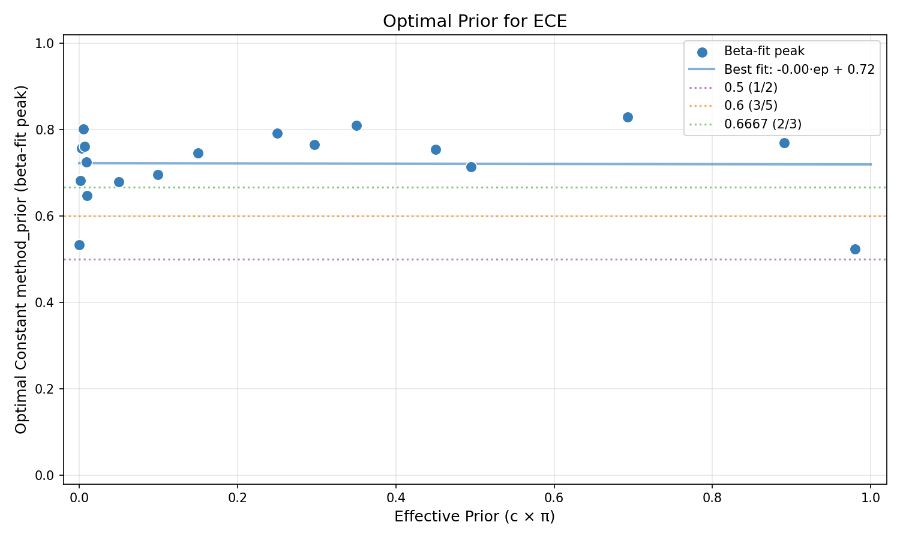

### Brier

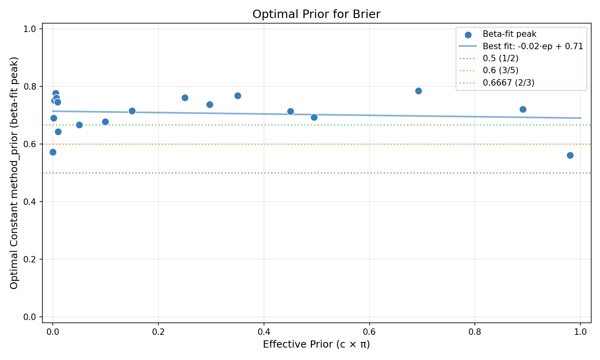

### Oracle CE

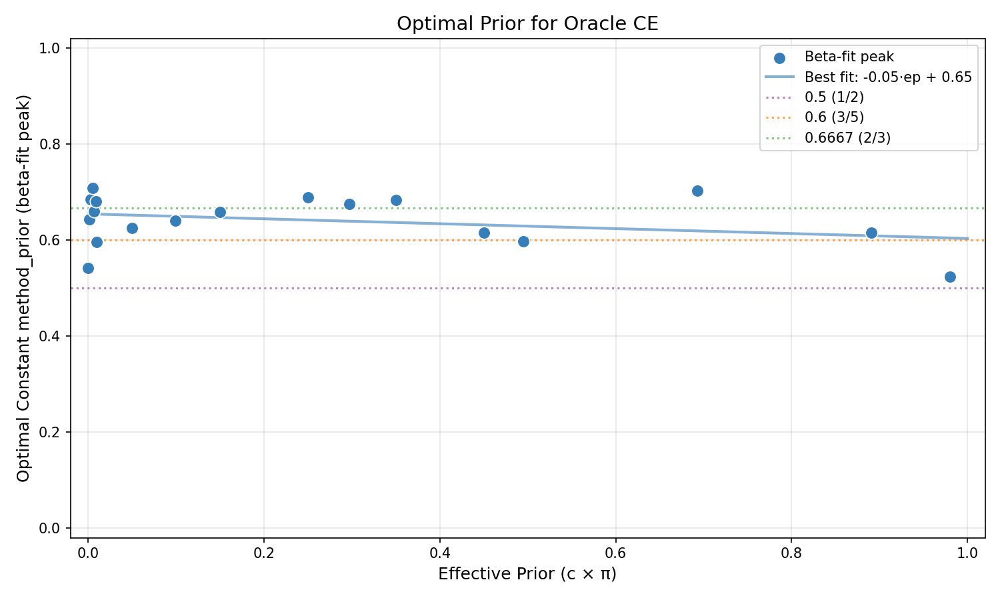

### A-NICE

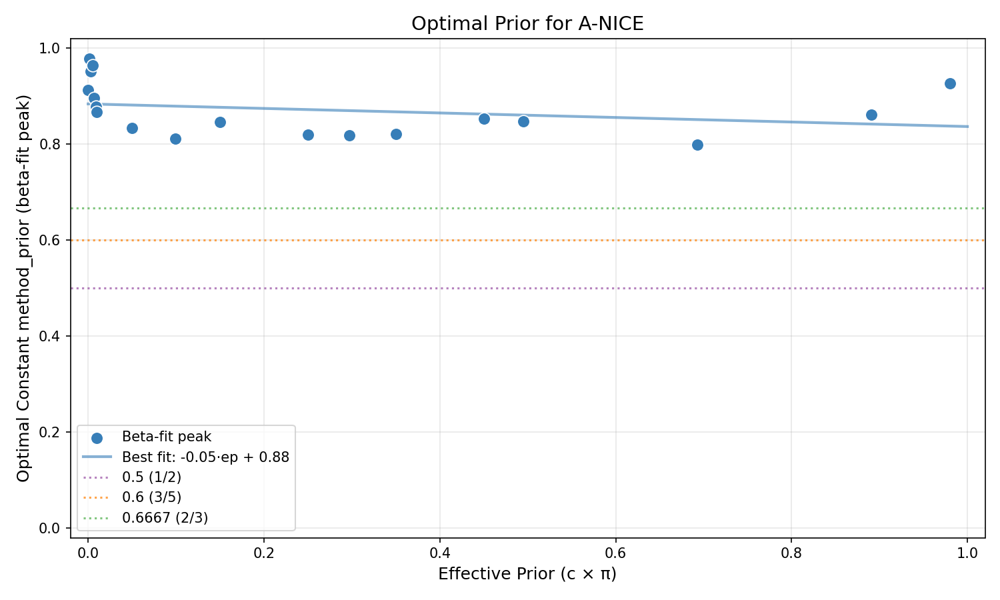

### S-NICE

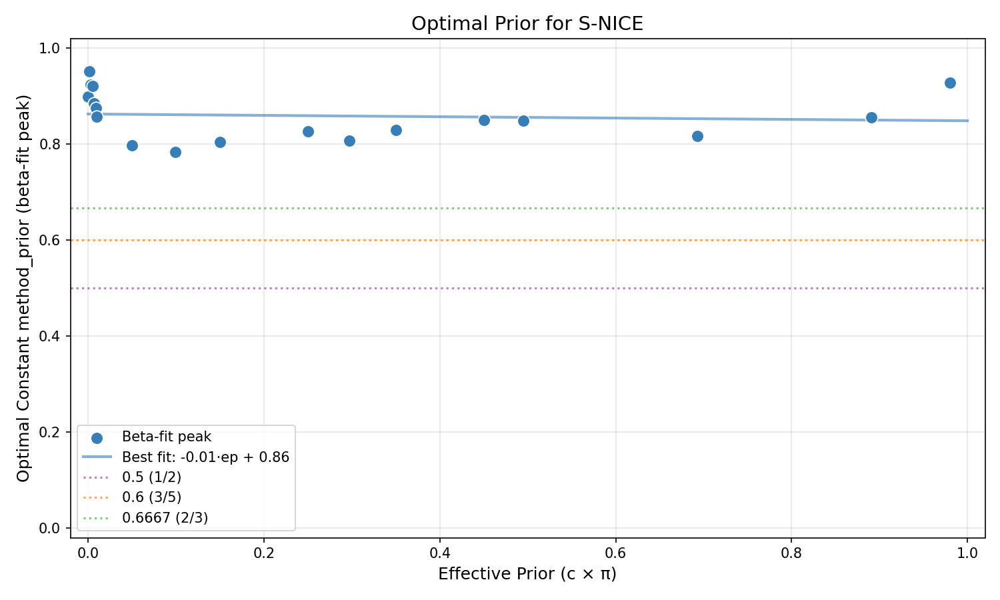

---

## Per-Dataset Best-Fit Lines (Beta-Fit)

*How much does the optimal method_prior vary across datasets?*
*Each row shows the best-fit line (slope·ep + intercept) for one dataset.*

| Dataset | AUC | AP | Max F1 | Accuracy | F1 | Precision | Recall | ECE | Brier | Oracle CE | A-NICE | S-NICE |
|---------|---|---|---|---|---|---|---|---|---|---|---|---|
| 20News | -0.03·ep + 0.53 | -0.04·ep + 0.54 | 0.06·ep + 0.47 | -0.06·ep + 0.68 | 0.01·ep + 0.80 | 0.25·ep + 0.14 | 0.80·ep + 0.41 | 0.02·ep + 0.68 | -0.02·ep + 0.67 | -0.07·ep + 0.63 | -0.06·ep + 0.90 | -0.01·ep + 0.87 |
| Connect4 | 0.02·ep + 0.49 | 0.14·ep + 0.42 | -0.39·ep + 0.66 | 0.18·ep + 0.72 | -0.07·ep + 0.91 | -0.93·ep + 0.92 | 0.16·ep + 0.63 | -0.02·ep + 0.83 | -0.05·ep + 0.83 | -0.09·ep + 0.75 | -0.13·ep + 0.88 | -0.06·ep + 0.85 |
| FashionMNIST | -0.01·ep + 0.60 | -0.10·ep + 0.55 | 0.13·ep + 0.47 | -0.02·ep + 0.82 | -0.02·ep + 0.86 | -0.59·ep + 0.66 | 0.14·ep + 0.80 | 0.07·ep + 0.82 | 0.03·ep + 0.81 | -0.01·ep + 0.77 | -0.01·ep + 0.86 | 0.03·ep + 0.83 |
| IMDB | 0.01·ep + 0.50 | 0.01·ep + 0.50 | -0.00·ep + 0.50 | -0.06·ep + 0.59 | -0.10·ep + 0.89 | 0.12·ep + 0.13 | 0.82·ep + 0.42 | -0.07·ep + 0.57 | -0.05·ep + 0.57 | -0.02·ep + 0.52 | -0.09·ep + 0.87 | -0.00·ep + 0.85 |
| MNIST | 0.11·ep + 0.66 | 0.01·ep + 0.66 | 0.05·ep + 0.62 | -0.08·ep + 0.83 | -0.04·ep + 0.87 | -0.57·ep + 0.57 | 0.15·ep + 0.80 | -0.39·ep + 0.87 | -0.04·ep + 0.81 | -0.00·ep + 0.77 | -0.02·ep + 0.87 | 0.02·ep + 0.84 |
| Mushrooms | -0.00·ep + 0.49 | 0.02·ep + 0.48 | -0.12·ep + 0.51 | -0.17·ep + 0.81 | -0.15·ep + 0.89 | -0.40·ep + 0.47 | 0.25·ep + 0.72 | -0.10·ep + 0.83 | -0.15·ep + 0.81 | -0.18·ep + 0.78 | 0.03·ep + 0.88 | 0.02·ep + 0.86 |
| Spambase | 0.33·ep + 0.19 | 0.37·ep + 0.36 | 0.37·ep + 0.19 | -0.14·ep + 0.54 | -0.03·ep + 0.82 | -0.22·ep + 0.25 | 0.67·ep + 0.50 | -0.04·ep + 0.54 | 0.00·ep + 0.51 | -0.03·ep + 0.54 | 0.01·ep + 0.85 | -0.00·ep + 0.84 |
| **Mean ± Std** | 0.06±0.12·ep + 0.50±0.14 | 0.06±0.14·ep + 0.50±0.09 | 0.01±0.21·ep + 0.49±0.14 | -0.05±0.10·ep + 0.71±0.11 | -0.06±0.05·ep + 0.86±0.04 | -0.34±0.39·ep + 0.45±0.27 | 0.43±0.30·ep + 0.61±0.16 | -0.08±0.14·ep + 0.74±0.13 | -0.04±0.05·ep + 0.72±0.12 | -0.06±0.06·ep + 0.68±0.11 | -0.04±0.05·ep + 0.87±0.02 | -0.00±0.03·ep + 0.85±0.01 |
| **Combined** | (see plots above) | (see plots above) | (see plots above) | (see plots above) | (see plots above) | (see plots above) | (see plots above) | (see plots above) | (see plots above) | (see plots above) | (see plots above) | (see plots above) |

---

## Best Constant method_prior per Bin × Metric

*Rows = effective-prior bins, columns = metrics. Each cell shows the best constant*
*method_prior value (excluding auto, true, ep_linear). Highlights which prior is optimal*
*for each (regime, metric) combination.*

| ep bin | AUC ↑ | AP ↑ | Max F1 ↑ | Accuracy ↑ | F1 ↑ | Precision ↑ | Recall ↑ | ECE ↓ | Brier ↓ | Oracle CE ↓ | Epochs ↓ |
|---|---|---|---|---|---|---|---|---|---|---|---|
| [0.00, 0.20) | 0.1111 | 0.1111 | 0.1111 | 0.7778 | 0.9900 | 0.0100 | 0.9900 | 0.5000 | 0.6667 | 0.6667 | 0.2222 |
| [0.20, 0.40) | 0.5556 | 0.1111 | 0.3333 | 0.5000 | 0.5556 | 0.1111 | 0.9900 | 0.6667 | 0.6667 | 0.5556 | 0.0100 |
| [0.40, 0.60) | 0.3333 | 0.5000 | 0.3333 | 0.5000 | 0.6667 | 0.1111 | 0.9900 | 0.7778 | 0.6667 | 0.6667 | 0.9900 |
| [0.60, 0.80) | 0.2222 | 0.2222 | 0.2222 | 0.5556 | 0.5556 | 0.1111 | 0.9900 | 0.7778 | 0.7778 | 0.7778 | 0.0100 |
| [0.80, 1.00) | 0.5000 | 0.5000 | 0.4444 | 0.5556 | 0.5556 | 0.2222 | 0.9900 | 0.4444 | 0.6667 | 0.6667 | 0.9900 |

---

## Key Finding

**Best method_prior under uniform effective-prior weighting: (ep+1)/3**
- Wins: 1/11 metrics
- Average rank: 4.27

This matches the naive (unweighted) winner ((ep+1)/3), confirming the result is robust.
